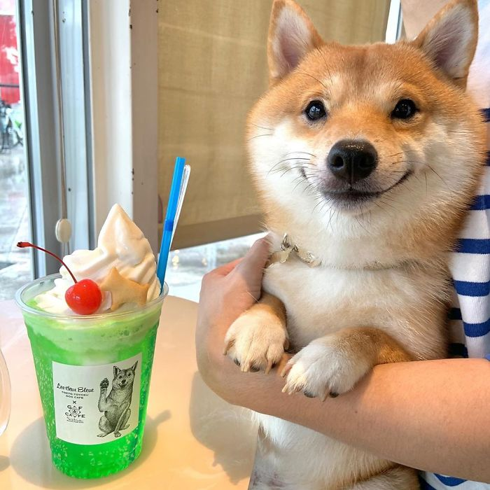

# Welcome to Allison Ngo's Page

[LinkedIn](https://www.linkedin.com/in/allison-ngo-2966061b3/)

[GitHub](https://github.com/aln017)

[Click this for a smile](doggo.jpg)

## About Me

I am currently a 2nd year Computer Science student at UCSD. I have aspirations to become a programmer or software developer.

**My current favorite programming language is C++.**

*I would like to learn JavaScript in the near future.*

John F. Kennedy once said:

> Those who dare to fail miserably can achieve greatly.

Therefore we must be willing to make mistakes before we can make great achievements.

## Skills

- C++
- Java
- Python
- HTML
- LaTex
- MATLAB

### [Completed Projects](https://devpost.com/software/gradescope-calendar)

1. GradeScope Scheduler
   - Scrapes due dates and assignment names from current classes on Gradescope and connects to Google Calendar to add them as events
   - Group project for SD Hacks hackathon

Here is a snippet of our use of the Google API:

```
SCOPES = ['https://www.googleapis.com/auth/calendar']

def access():
    creds = None;

    if os.path.exists('token.pkl'):
        with open('token.pkl', 'rb') as token:
            creds = pickle.load(token)
```


2. BitCoin Tracker
   - Script to scrape bitcoin prices every 5 minutes and record data (date, time, price, percent increase) in a csv file

### Future Project Ideas

1. Canvas to Notion Assignment Scheduler
   - Connect Canvas to Notion and use assignment data on Canvas to create reminders on Notion
2. Food Delivery Services Comparison App
   - Compares the cost of food delivery across different services and offers the most ideal
3. Proper Waste Disposal Helper
   - User inputs an item (electronics, perfumes, microplastics) and app offers nearby locations to properly/safely dispose of certain items

### Extra

***I like happy doggos!***





